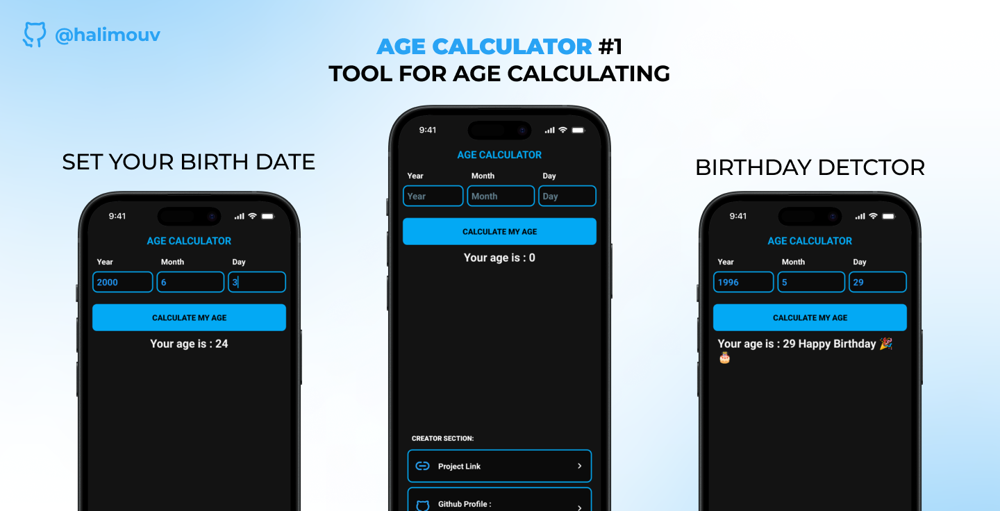

# Age Calculator App ( Android Java )

---

## Overview
Age Calculator is a simple Android application that calculates your age based on your birth date. It features a clean and intuitive interface to provide quick and accurate results.

---

## Features
- Select your birth date using a date picker
- Calculate age instantly
- User-friendly and responsive design
- Lightweight and fast

---

## Screenshots

  
*Home screen with date picker*

---

## Download APK

Download the latest APK here:  
[Age Calculator APK](https://github.com/halimouv/age-calculator-app/releases/)

---

## Installation
1. Clone the repository  
   `git clone https://github.com/halimouv/age-calculator-app.git`

2. Open the project in Android Studio  
3. Build and run the app on your emulator or device

---

## License
This project is licensed under the MIT License - see the [LICENSE](LICENSE) file for details.

---

## Contact
For any questions or suggestions, please open an issue or contact me at xyz.halim2003@gmail.com.
